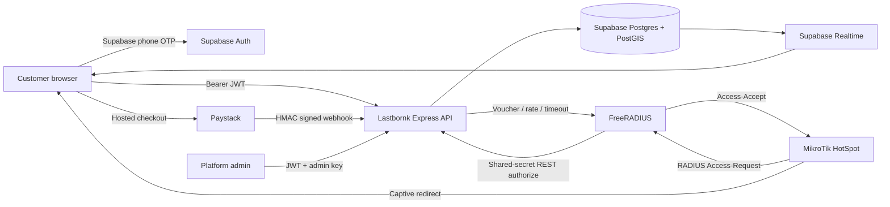

# Lastbornk production setup

This scaffold replaces demo wallet mutations with an authenticated Supabase/PostgreSQL backend, signed Paystack webhooks, PostGIS proximity search, Supabase Realtime chat, customer-care tickets, and a MikroTik/FreeRADIUS captive-portal handshake.

## Architecture



## 1. Supabase database

1. Create a Supabase project.
2. Install the Supabase CLI and link the project.
3. Run:

   ```bash
   supabase link --project-ref YOUR_PROJECT_REF
   supabase db push
   ```

   Alternatively, run `supabase/migrations/001_lastbornk.sql` once in SQL Editor.
4. In **Authentication → Providers → Phone**, enable a supported SMS provider.
5. Verify that `messages` is enabled under **Database → Replication / Realtime**.
6. Schedule `select public.expire_voucher_sessions();` every minute with Supabase Cron.
7. Create hosts using the app or adapt `supabase/seed.example.sql` with real Auth UUIDs.

### Important database properties

- Wallet debit, host credit, voucher issuance, and transaction creation occur in one locked `purchase_voucher()` PostgreSQL transaction.
- Paystack credits are idempotent: a unique provider reference and locked payment intent prevent double credit from webhook retries.
- `wallet_balance` cannot become negative.
- PostGIS `ST_DWithin` and a GiST index perform efficient radius searches.
- RLS restricts profiles, sessions, payments, messages, and tickets to their participants.
- The service-role/secret key is server-only and bypasses RLS. Never place it in a `VITE_*` variable.

## 2. Environment and local development

```bash
cp .env.example .env
# Fill in Supabase and Paystack values
npm install
npm run dev
```

Frontend: `http://localhost:5173`  
API: `http://localhost:4000`

For UI-only demo mode, leave Supabase variables unset. For production functionality, set them and disable/remove `DEV_BYPASS_AUTH`.

## 3. Paystack wallet setup

1. Copy your Paystack test secret to `PAYSTACK_SECRET_KEY`.
2. Set the Paystack dashboard webhook URL to:

   ```text
   https://api.lastbornk.ng/api/payments/webhook/paystack
   ```

3. Pressing **Add money** calls `POST /api/payments/initialize`. The backend creates a pending payment intent and initializes Paystack in kobo.
4. Paystack redirects the user back and also sends `charge.success` to the webhook.
5. The webhook hashes the untouched raw body with HMAC-SHA512 and compares it with `x-paystack-signature` using a timing-safe comparison.
6. Only `charge.success`, `status=success`, `currency=NGN`, and an exact payment-intent amount can credit a wallet.
7. Test cards and webhook delivery should be completed in Paystack test mode before switching to `sk_live_*`.

Do not credit from a frontend callback. The callback verification endpoint is idempotent, but the signed webhook is the authoritative asynchronous path.

## 4. Nearby hotspot and voucher flow

1. **Use my location** invokes the browser Geolocation API.
2. Coordinates are sent to `GET /api/hosts/nearby?lat=...&lng=...&radius=15000` with the user's JWT.
3. PostgreSQL returns only online hosts within the radius, sorted by geodesic distance.
4. Connect calls `POST /api/vouchers/purchase`.
5. `purchase_voucher()` locks the wallet and host rows, checks balance and host state, debits the user, credits host earnings, logs both sides, and creates a time-limited access code atomically.

Production should rate-limit purchases further per user/device and apply your refund and host-payout policy.

## 5. Messaging and support

- `MessageHostModal` subscribes to Supabase Realtime inserts for the booked host room.
- RLS permits only message participants to read a room and prevents a customer from messaging arbitrary accounts.
- `HostInbox` groups messages by customer, sorts from newest data, displays unread counts, and replies in real time.
- `SupportModal` offers the required issue categories and creates a ticket tied to the active host when available.
- `AdminTicketDashboard` reads and resolves tickets. Admin API actions require both an authenticated Supabase user whose `users.role='admin'` and `x-admin-key`.
- Wallet adjustment uses the atomic `admin_adjust_wallet()` RPC and creates an audit transaction. Session reset rotates the access code.

Place the admin dashboard on a separate protected domain in production, add MFA, and record all admin activity in a dedicated audit-log table or external SIEM.

## 6. MikroTik captive portal and AAA

### Router files

1. Edit `mikrotik/hotspot/login.html`:
   - Replace `https://app.lastbornk.ng`.
   - Replace `HOST_UUID` with that router's `hosts.id`.
2. Upload `login.html` and `logout.html` to the router's `hotspot/` Files directory.
3. Edit and import `mikrotik/routeros-setup.rsc`.
4. Ensure `hosts.router_identity` exactly matches `/system identity print`.
5. Add the app, Supabase project, and Paystack checkout to the HotSpot walled garden so unauthenticated clients can pay and authenticate.

The router substitutes `$(mac-esc)`, `$(link-login-only-esc)`, and other values, then redirects the phone to:

```text
https://app.lastbornk.ng/captive?host=...&mac=...&loginUrl=...
```

After payment, the browser creates a POST form back to `link-login-only` with the voucher code as username and password.

### Central RADIUS verification

MikroTik cannot validate a row in Supabase directly. Use FreeRADIUS as central AAA:

1. Add the router as a RADIUS client with its private shared secret.
2. Install/enable the FreeRADIUS REST module.
3. Adapt files under `mikrotik/freeradius/` and inject `NETWORK_SHARED_SECRET` from a secret manager.
4. FreeRADIUS sends username, password, client MAC, and NAS identity to `POST /api/network/authorize`.
5. The API validates the active, unexpired voucher; matching host router; bound device MAC; and hotspot online state.
6. It returns `Mikrotik-Rate-Limit`, `Session-Timeout`, and `Simultaneous-Use` attributes.

Run FreeRADIUS and the API over private networking/VPN where possible. Never expose the MikroTik management API publicly. Restrict UDP 1812/1813 to known router/VPN addresses, use unique secrets per router, and rotate them.

## 7. Deployment checklist

- [ ] Deploy the frontend and API over HTTPS on separate or same-site domains.
- [ ] Set exact CORS origin in `APP_URL`.
- [ ] Store Supabase secret key, Paystack secret, admin key, and network secret in the host's secret manager.
- [ ] Disable `DEV_BYPASS_AUTH`.
- [ ] Apply the SQL migration and verify RLS with multiple test users.
- [ ] Configure Supabase Phone Auth and production SMS limits.
- [ ] Configure Paystack signed webhook and test duplicate deliveries.
- [ ] Configure Supabase Cron session expiry.
- [ ] Deploy and firewall FreeRADIUS.
- [ ] Test captive detection on Android and iOS.
- [ ] Test insufficient funds, offline host, expired voucher, reused payment reference, MAC mismatch, and router outage.
- [ ] Add monitoring for webhook failures, RADIUS rejects, payment reconciliation, and database errors.
- [ ] Perform a security review and Nigerian data-protection/payment-compliance review before handling real funds.

## Relevant source locations

| Concern | Location |
|---|---|
| Database, RPCs, RLS | `supabase/migrations/001_lastbornk.sql` |
| Paystack initialize/webhook | `server/payments.js` |
| Nearby, vouchers, chat, tickets, admin, RADIUS | `server/api.js` |
| Supabase auth middleware | `server/auth.js` |
| Geolocation | `src/lib/location.js` |
| Realtime messaging/support UI | `src/components/NetworkFeatures.jsx` |
| Captive router login POST | `src/lib/captive.js` |
| MikroTik redirect | `mikrotik/hotspot/login.html` |
| Router/RADIUS templates | `mikrotik/` |
